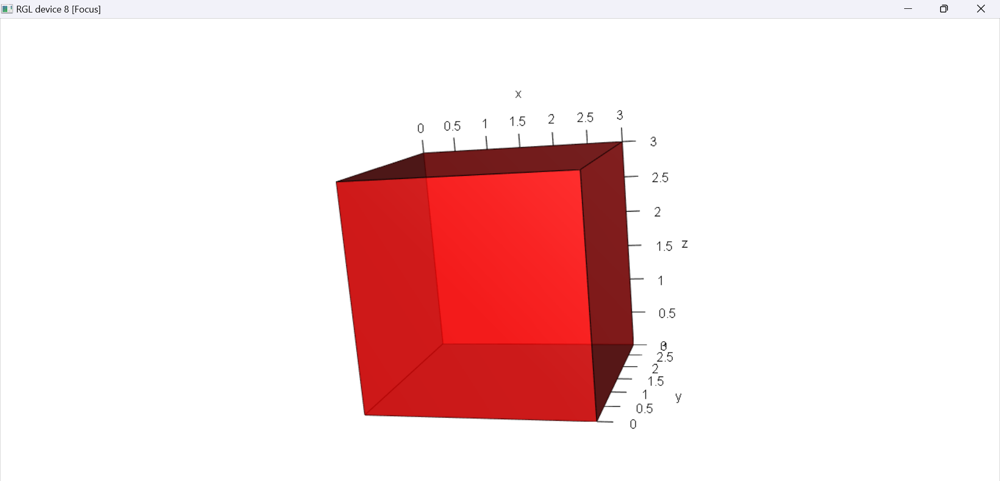
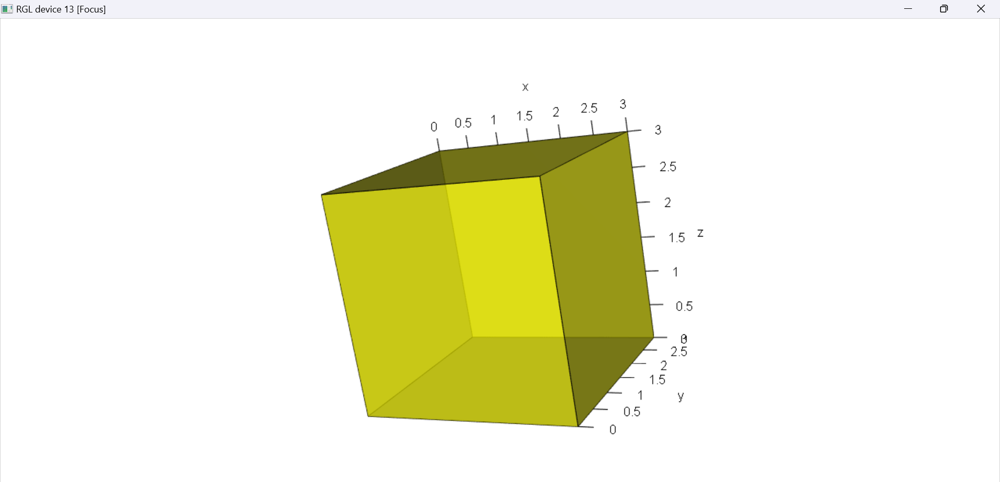

```{r, include = FALSE}
knitr::opts_chunk$set(
  fig.width = 7,
  fig.height = 5,
  fig.align = "center",
  collapse = TRUE,
  comment = "#>"
)
```


## Introduction

`shaper` is an R package which allows to create, analyze and visualize some basic two-dimensional (2D) and three-dimensional (3D) shapes. Our journey through this vignette will take us from basic constructs of simple shapes like squares and circles, to the more complex realms of cuboids and spheres.

## Background

Geometry is a fundamental branch of mathematics that finds extensive applications in areas ranging from architectural design and engineering to computer graphics and data visualization. In R, the manipulation and visualization of geometric shapes not only enhance the understanding of spatial concepts but also enrich the graphical representation of data.

## What You Will Learn

In this vignette, we dive into:

__Creation of Geometric Shapes__: We'll start by defining and creating basic 2D shapes such as rectangles, squares, circles, and triangles, and 3D shapes like cuboids, cubes, spheres, and cylinders. Each shape is created through custom R functions, encapsulating properties like dimensions.

__Analytical Functions__: Explore functions to calculate key properties of these shapes, such as area and perimeter for 2D shapes, and volume for 3D shapes. These functions demonstrate how mathematical principles are applied programmatically.

__Summarization of Shape Properties__: Learn how to use a summary function that elegantly displays important attributes of a shape, like its type, area, perimeter (for 2D shapes), and volume (for 3D shapes).

__Visualization__: Delve into methods for visualizing these shapes in R. We'll use ggplot2 for plotting 2D shapes and rgl for rendering 3D shapes, showcasing how different R packages can be employed for effective visualization.

## Installation

shaper will run in Windows, Mac OS X, or Linux. To install it you first need to install [R](https://cran.r-project.org/). Installing [RStudio](https://www.rstudio.com/) as a nice desktop environment for using R is also recommended.

Once in R you can type at the R command prompt:

```{r, eval=FALSE}
install.packages('devtools')
devtools::install_github('EClancyMU/shaper')
```

to install the latest development version of the package from shaper [GitHub page](https://github.com/EClancyMU/shaper).

In either case, if you then type:

```{r,message=FALSE}
library(shaper)
```

it will load in all the aforementioned **shaper** functions.

Some features may not yet be fully tested, and occasionally this version might be liable to break when it is in the process of being updated. If you find bugs or want to suggest new features please visit the [GitHub issues page](https://github.com/EClancyMU/shaper/issues).

## Creation of Generic Shapes

This section will guide you through creating basic 2D and 3D shapes. Let's explore how to use these functions to instantiate shapes like rectangles, squares, circles and more demonstrating their simplicity and versatility.

__Rectangle__

Create a rectangle by specifying the its height and width. For example, to create a rectangle of height 2 and width 3

```{r}
r <- rectangle(2,3)
```

__Square__

Create a square by providing the length of its side. For example, to create a square of side length 4

```{r}
s <- square(4)
```

__Circle__

To create a circle, you only need to specify its radius. Here's an example of creating a circle with a radius of 5

```{r}
c <- circle(5)
```

__Triangle__

A triangle can be created by specifying the lengths of its three sides. For example, here's a triangle with sides 3,4 and 5

```{r}
t <- triangle(3,4,5)
```

__Cuboid__

A cuboid can be created by defining its height, width and depth. Here's a cuboid with dimensions 2x3x4

```{r}
cu <- cuboid(2,3,4)
```

__Cube__

Create a cube by providing its side length. For instance, here's a cube with side length 3

```{r}
cub <- cube(3)
```

__Sphere__

To create a sphere, provide its radius. For example, to create a sphere of radius 6

```{r}
sp <- sphere(6)
```

__Cylinder__

A cylinder requires a radius and height. Here's a cylinder with a radius of 3 and height of 5

```{r}
cy <- cylinder(3,5)
```

## Analyzing Functions

After creating various geometric shapes, we can find out some basic properties and this section covers the functions used to calculate the area, perimeter (for 2D shapes), and volume (for 3D shapes) of any shape from the above section.

### Calculating Area

The `area` function is used to calculate the area of both 2D and 3D shapes. It only takes one parameter which is the object created to store a shape. For example, to calculate the area of a rectangle created in the earlier section
```{r}
area(r)
#area.rectangle(r)
```

Similarly we can find the area for all others shapes using the same format. 


### Calculating Perimeter (For 2D Shapes)

The `perimeter` function calculates the perimeter of a given 2D shape. Just like area function this one as well takes only the object parameter. Here's an example on how to find the perimeter of a circle
```{r}
c <- circle(5)
perimeter(c)
perimeter(r)
#perimeter.circle(c)
```
The same format can be used to find out the perimeter for remaining 2D shapes.


### Calculating Volume (For 3D Shapes)

The `volume` function calculates the volume of 3D shapes and only takes in the object created to store a 3D shape as a parameter. For example, to find out the volume of a cylinder (cy) which was created above
```{r}
volume(cy)
```

Similarly, we can find the volume of other 3D shapes using the same format.


## Summarization of Shape Properties

The `summary` function in the package provides a convenient way to display key attributes of a shape. It will display the shape's type along with its relevant properties such as area and perimeter for 2D shapes, or surface area and volume for 3D shapes.

### Summary of a 2D shape

For a 2D shape like a rectangle, square, circle or triangle, the `summary` function will display the shape type, its perimeter and its area. Here's an example of using the `summary` function on a rectangle.
```{r}
summary(r)
```

### Summary of a 3D shape

For a 3D shape like cuboid, cube, sphere or a cylinder, the `summary` function will include the shape type, its surface area and volume. For example, to use the `summary` function on a cube
```{r}
cub <- cube(3)
summary(cub)
```

## Visualization

Visualization is a crucial aspect when working with geometric shapes and the `draw` function this package provides capabilities to visualize both 2D and 3D shapes.

### Drawing 2D shapes

For 2D shapes, such as rectangles, squares, circles, and triangles, the `draw` function utilizes `ggplot2` to create clear and detailed visualizations.

To visualize a rectangle, firstly load the `ggplot2` package and then simply create the shape and use the draw function
```{r}
library(ggplot2)
draw(s)
draw(r)
```

The same command can be used to visualize other 2D shapes such as square, circle and triangle.

Users can also pass in other attributes such as color of the shape (outline of the shape) as well can fill color inside the shape with the default values being "blue" and "transparent" respectively.

Here's the same rectangle with different color and fill values.
```{r}
r <- rectangle(2, 3)
draw(r, color = "green", fillColor = "red")
```

### Drawing 3D shapes

For 3D shapes like cuboid, cube, sphere and cylinder, the `draw` function leverages the `rgl` package to render these shapes in three-dimensional space.

To visualize a cube, first load the `rgl` package and then create the 3D shape and call in the draw function
```{r}
library(rgl)
cub <- cube(3)
draw(cub)
```


This command will open a new window displaying the 3D cube which can be interacted such as allowing for rotation and zooming to examine the shape. As all the 3D shapes open in a window, here's what exactly the window looks like for the cube created above.

{width=600px height=300px}

The same command can be used to visualize other 3D shapes such as cuboid, sphere and cylinder and just like 2D shapes, users can also change the color of the 3D by changing the value of the color attribute with the default being "red"

```{r}
cub <- cube(3)
draw(cub, color = "yellow")
```

{width=600px height=300px}
